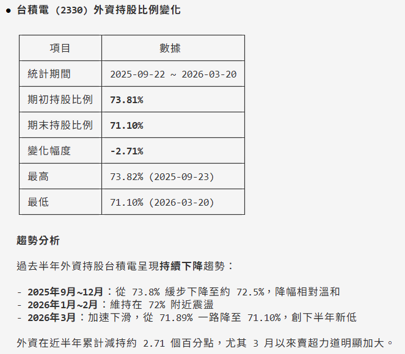
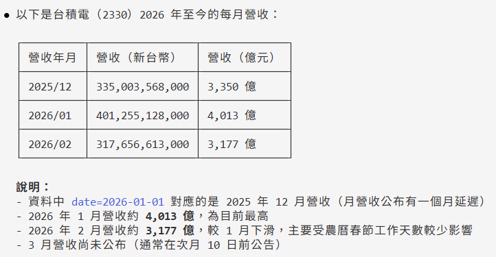
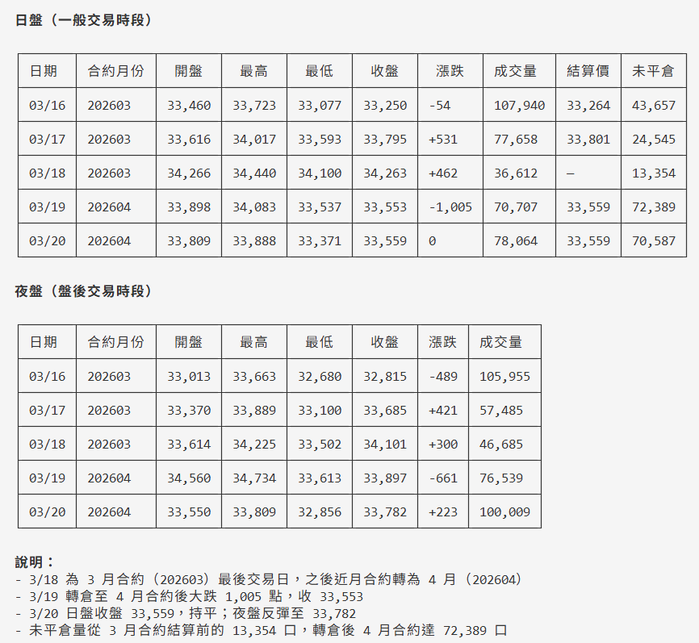
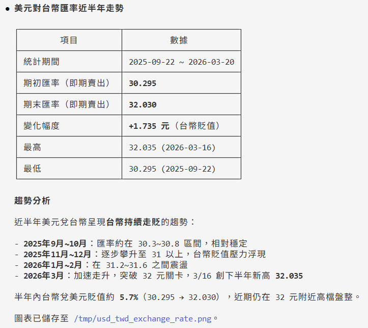

FinMind provides an AI Agent Skill that lets you query 75+ FinMind datasets through natural language inside AI tools such as [Gemini](https://gemini.google.com/), [Claude Code](https://docs.anthropic.com/en/docs/claude-code/overview), [Codex](https://github.com/openai/codex), [Cursor](https://www.cursor.com/), and [Windsurf](https://windsurf.com/), without having to assemble API parameters yourself.

## Installation

### Step 1: Download the Skill

!!! example
    === "Claude Code"
        ```bash
        mkdir -p ~/.claude/commands
        curl -o ~/.claude/commands/finmind.md https://raw.githubusercontent.com/FinMind/FinMind/master/.claude/commands/finmind.md
        ```
    === "Codex"
        ```bash
        curl -o AGENTS.md https://raw.githubusercontent.com/FinMind/FinMind/master/.claude/commands/finmind.md
        ```
    === "Cursor"
        ```bash
        mkdir -p .cursor/rules
        curl -o .cursor/rules/finmind.mdc https://raw.githubusercontent.com/FinMind/FinMind/master/.claude/commands/finmind.md
        ```
    === "Windsurf"
        ```bash
        curl -o .windsurfrules https://raw.githubusercontent.com/FinMind/FinMind/master/.claude/commands/finmind.md
        ```
    === "Gemini"
        ```bash
        curl -o GEMINI.md https://raw.githubusercontent.com/FinMind/FinMind/master/.claude/commands/finmind.md
        ```

### Step 2: Set Up the Token

Register at [FinMind](https://finmindtrade.com/analysis/#/account/register) and verify your email to obtain a token.

```bash
export FINMIND_TOKEN="your_token_here"
```

We recommend adding this to `~/.bashrc` or `~/.zshrc` so it loads automatically every time you open a terminal.

### Step 3: Use It

In Claude Code, type `/finmind` followed by what you want to query:

```
/finmind TSMC stock prices for the past month
```

---

## Examples

### Stock Price Queries

```
/finmind TSMC stock prices for the past month
```

> Expected result: returns a daily stock price table for TSMC (2330) over the past month, including columns such as date, open, high, low, close, and volume.


```
/finmind Compare 2330 and 2317 stock prices over the past three months
```

> Expected result: queries TSMC and Hon Hai stock prices over the past three months and presents a closing-price comparison of both stocks in a table.


### Chip / Institutional Data

```
/finmind 2330 institutional investors trading over the past week
```

> Expected result: returns daily net buy/sell volumes (in lots) for foreign investors, investment trusts, and dealers for TSMC over the past week.


```
/finmind TSMC foreign investor shareholding ratio history
```

> Expected result: returns a historical table of TSMC's foreign investor shareholding (in lots) and shareholding ratio.



### Fundamentals

```
/finmind TSMC monthly revenue this year
```

> Expected result: returns TSMC's monthly revenue figures for the current year.



```
/finmind 2330 PER trend over the past five years
```

> Expected result: returns TSMC's historical price-to-earnings ratio (PER), price-to-book ratio (PBR), and dividend yield over the past five years.

### Futures and Options

```
/finmind TAIEX near-month futures contract weekly trading info
```

> Expected result: returns daily open/high/low/close, volume, and open interest for TAIEX futures (TX) over the past week.



```
/finmind TAIEX options institutional investors trading today
```

> Expected result: returns today's long/short trading volumes (in contracts) and amounts by the three institutional investors for TAIEX options (TXO).

### Macroeconomy

```
/finmind USD/TWD exchange rate trend over the past six months
```

> Expected result: returns daily spot buy/sell USD/TWD exchange rates over the past six months.



```
/finmind Federal Reserve interest rate changes over the past ten years
```

> Expected result: returns the Fed's historical interest rate adjustment records over the past ten years.

```
/finmind Gold price trend over the past year
```

> Expected result: returns daily gold prices over the past year.

### Charts

```
/finmind TSMC candlestick chart for the past three months
```

> Expected result: generates a candlestick chart for TSMC over the past three months, including OHLC, moving averages, and volume, saved as an image file.


```
/finmind Compare 2330 and 2317 stock prices over the past six months, plot a chart
```

> Expected result: generates a line chart comparing the closing prices of the two stocks, saved as an image file.


```
/finmind USD exchange rate trend chart for the past year
```

> Expected result: generates a USD/TWD exchange rate line chart, saved as an image file.

### Advanced Analysis

```
/finmind Compare TSMC and MediaTek stock returns over the past year
```

> Expected result: calculates the cumulative return rates of both stocks over the past year and presents the comparison in a table or chart.

```
/finmind 2330 dividend policy summary for the past three years
```

> Expected result: summarizes TSMC's cash dividends, stock dividends, ex-dividend dates, and payment dates for the past three years.

```
/finmind TAIEX index every-5-second trend today
```

> Expected result: returns the TAIEX weighted index value every 5 seconds for today, showing the intraday trend.
