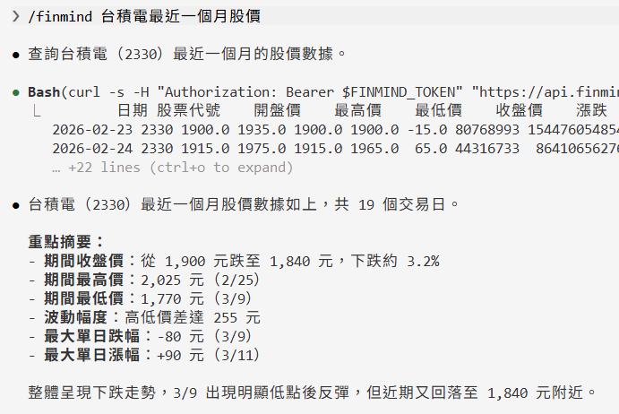
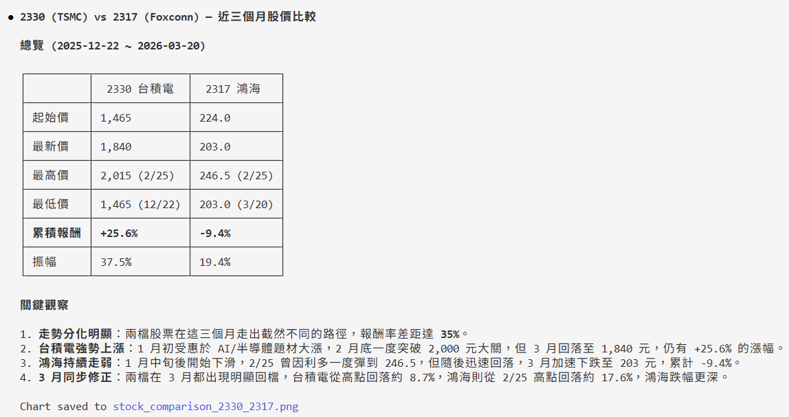
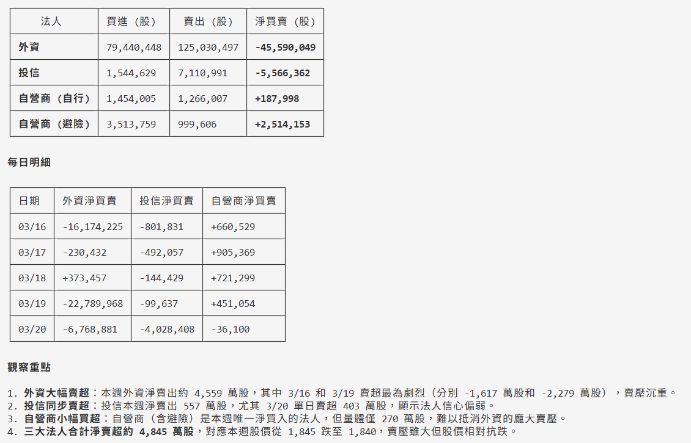
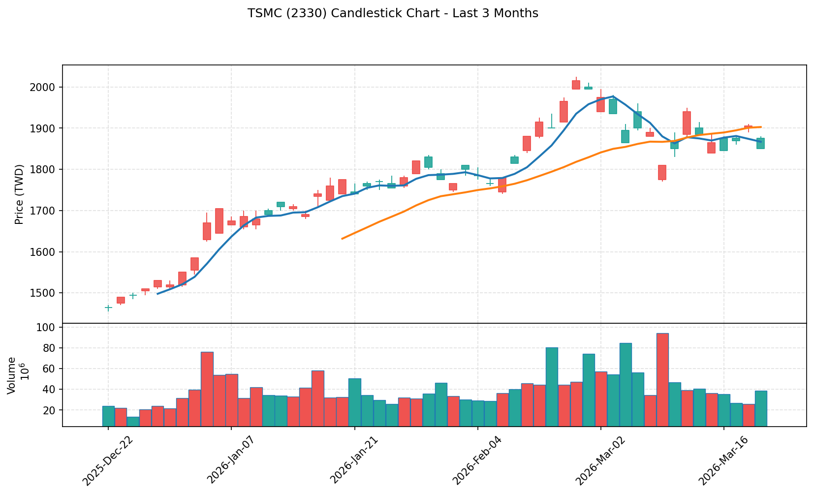
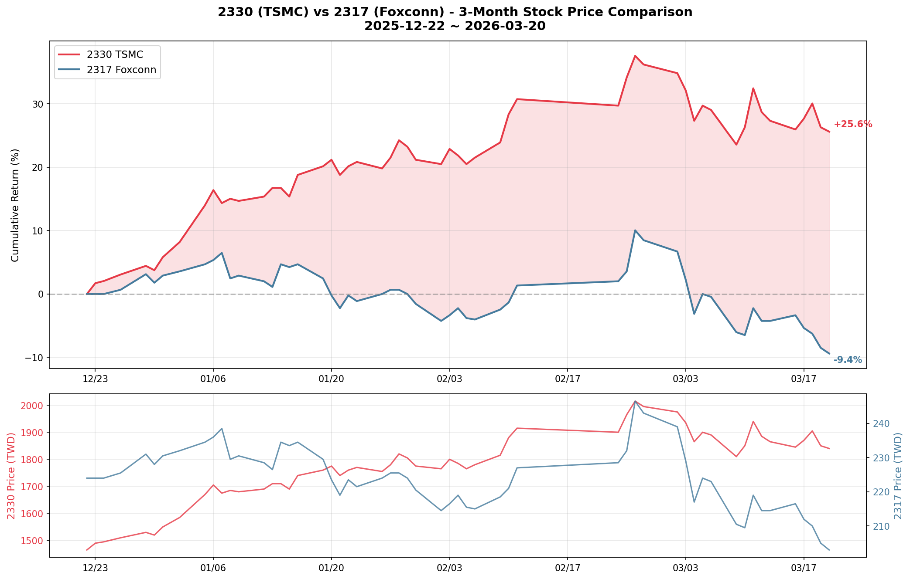

FinMind 提供 [Claude Code](https://docs.anthropic.com/en/docs/claude-code/overview) Agent Skill，讓你可以在 Claude Code 中，透過自然語言查詢 FinMind 75+ 種資料集，不需要自己組 API 參數。

## 安裝

### 步驟 1: 下載 Skill

```bash
mkdir -p ~/.claude/commands
curl -o ~/.claude/commands/finmind.md https://raw.githubusercontent.com/FinMind/FinMind/master/.claude/commands/finmind.md
```

### 步驟 2: 設定 Token

至 [FinMind](https://finmindtrade.com/analysis/#/account/register) 註冊並驗證信箱後，取得 Token。

```bash
export FINMIND_TOKEN="your_token_here"
```

建議加到 `~/.bashrc` 或 `~/.zshrc`，這樣每次開終端都會自動載入。

### 步驟 3: 使用

在 Claude Code 中輸入 `/finmind`，後面接你想查詢的內容：

```
/finmind 台積電最近一個月股價
```

---

## 範例

### 股價查詢

```
/finmind 台積電最近一個月股價
```

> 預期結果：回傳台積電（2330）近一個月的每日股價表格，包含日期、開盤價、最高價、最低價、收盤價、成交量等欄位。



```
/finmind 2330 跟 2317 近三個月股價比較
```

> 預期結果：分別查詢台積電和鴻海近三個月股價，並以表格呈現兩檔股票的收盤價走勢比較。



### 籌碼面

```
/finmind 2330 三大法人近一週買賣
```

> 預期結果：回傳台積電近一週外資、投信、自營商的每日買賣超張數。



```
/finmind 台積電外資持股比例變化
```

> 預期結果：回傳台積電外資持股張數與持股比例的歷史資料表格。

### 基本面

```
/finmind 台積電今年每月營收
```

> 預期結果：回傳台積電今年度各月份的營收數字。

```
/finmind 2330 近五年 PER 走勢
```

> 預期結果：回傳台積電近五年的本益比（PER）、股價淨值比（PBR）、殖利率歷史資料。

### 期貨選擇權

```
/finmind 台指期近月合約近一週成交資訊
```

> 預期結果：回傳台指期貨（TX）近一週的每日開高低收、成交量、未平倉量等資料。

```
/finmind 台指選擇權三大法人今日買賣
```

> 預期結果：回傳台指選擇權（TXO）今日三大法人的多空交易口數與金額。

### 總體經濟

```
/finmind 美元對台幣匯率近半年走勢
```

> 預期結果：回傳近半年 USD/TWD 的每日即期買入、賣出匯率。

```
/finmind 聯準會近十年利率變化
```

> 預期結果：回傳 FED 近十年的利率調整歷史紀錄。

```
/finmind 黃金價格近一年走勢
```

> 預期結果：回傳近一年的每日黃金價格。

### 圖表

```
/finmind 台積電近三個月 K 線圖
```

> 預期結果：產生台積電近三個月的 K 線圖，包含開高低收、均線與成交量，儲存為圖片檔。



```
/finmind 2330 跟 2317 近半年股價比較，畫圖
```

> 預期結果：產生兩檔股票收盤價的折線比較圖，儲存為圖片檔。



```
/finmind 美元匯率近一年走勢圖
```

> 預期結果：產生 USD/TWD 匯率折線圖，儲存為圖片檔。

### 進階分析

```
/finmind 比較台積電和聯發科近一年股價報酬率
```

> 預期結果：計算兩檔股票近一年的累積報酬率，並以表格或圖表呈現比較。

```
/finmind 2330 近三年股利政策整理
```

> 預期結果：整理台積電近三年的現金股利、股票股利、除息日、發放日等資訊。

```
/finmind 台股加權指數今天每 5 秒走勢
```

> 預期結果：回傳今日台股加權指數每 5 秒的即時數值，呈現盤中走勢。
